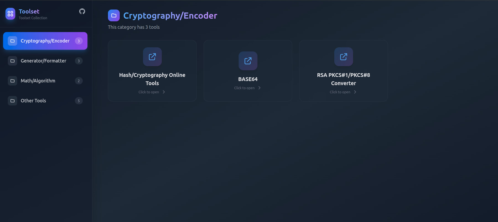

# Toolset

> The initial version of this project was generated by AI.

A modern toolset application built with Vite + React + Tailwind CSS.



## Features

- 🎨 **Modern Interface**: Dark theme with clean and beautiful design
- 📁 **Category Navigation**: Display tool categories on the left, click to view tool list
- 🔗 **Open in New Window**: Click tool cards to open tool links in new windows
- 📱 **Responsive Layout**: Tool cards use flexible grid layout, adaptive to different screens
- ⚙️ **Configurable**: Easily manage toolset through JSON files
- 🐳 **Docker Support**: Provide Dockerfile and docker-compose configuration

## Tech Stack

- **Vite**: Fast frontend build tool
- **React**: User interface library
- **Tailwind CSS**: Utility-first CSS framework
- **Nginx**: High-performance static file server

## Project Structure

```
toolset-app/
├── src/
│   ├── App.jsx          # Main application component
│   ├── App.css          # Application styles
│   ├── main.jsx         # Application entry point
│   ├── index.css        # Global styles (includes Tailwind)
│   └── tools.json       # Tool configuration file
├── public/              # Static assets
├── index.html           # HTML template
├── tailwind.config.js   # Tailwind configuration
├── postcss.config.js    # PostCSS configuration
├── nginx.conf           # Nginx configuration file
├── Dockerfile           # Docker image build file
├── docker-compose.yml   # Docker Compose configuration
├── .dockerignore        # Docker ignore file
└── package.json         # Project dependencies
```

## Configure Toolset

Edit the `src/tools.json` file to add or modify tools:

```json
{
  "categories": [
    {
      "name": "Category Name",
      "tools": [
        {
          "name": "Tool Name",
          "url": "Tool URL"
        }
      ]
    }
  ]
}
```

## Development

```bash
# Install dependencies
npm install

# Start development server
npm run dev

# Build production version
npm run build

# Preview production build
npm run preview
```

## Docker Deployment

### Build with Docker

```bash
# Build image
docker build -t toolset-app .

# Run container
docker run -d -p 8080:80 --name toolset-app toolset-app
```

### Use Docker Compose

```bash
# Start services
docker-compose up -d

# Stop services
docker-compose down

# View logs
docker-compose logs -f
```

### Access Application

After deployment, visit `http://localhost:8080` in your browser

## Usage Instructions

1. Left navigation bar displays all tool categories
2. Click category to display all tools in that category on the right
3. Tools are displayed as cards with responsive grid layout
4. Click tool cards to open tool links in new windows

## Docker Configuration

- **Multi-stage Build**: Use Node.js to build application, use Nginx to serve static files
- **Image Optimization**: Based on Alpine Linux, small image size
- **Performance Optimization**: Enable Gzip compression, configure static resource caching
- **Security Configuration**: Add security response headers, deny access to hidden files
- **SPA Support**: Configure Nginx to support React Router
